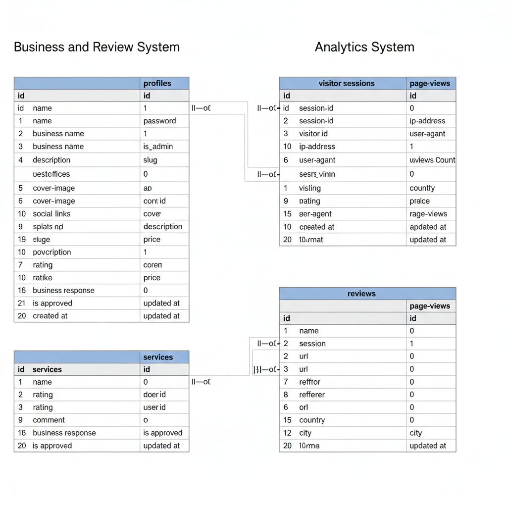

# Database Schema Documentation

## Entity Relationship Diagram (ERD)

    The full notation ∣∣−o{ specifies a relationship where:

    From the "One" side: The first vertical line (∣∣) means Mandatory. An instance of the entity on this side must participate in the relationship.

    To the "Many" side: The "o" (o) means Optional. An instance of the entity on the "many" side may not exist (minimum of 0).

    Cardinality: The crow's foot ({) means the maximum is Many.

### Tables and Relationships

- **users**
  - `id` (PK): Primary key
  - `name`: User's name
  - `email`: Unique email address
  - `password`: Hashed password
  - `is_admin`: Boolean, admin flag
  - `timestamps`: Created/updated at
  - **Relationships:**
    - Has many `profiles`
    - Has many `reviews` (nullable)

- **profiles**
  - `id` (PK): Primary key
  - `user_id` (FK): References `users.id`
  - `business_name`, `slogan`, `description`, `phone`, `email`, `website`, `location`: Business info
  - `cover_image`, `profile_image`: Image paths
  - `social_links`, `theme_colors`: JSON fields
  - `slug`: Unique business slug
  - `is_published`: Boolean
  - `timestamps`: Created/updated at
  - **Relationships:**
    - Belongs to `user`
    - Has many `services`
    - Has many `reviews`

- **services**
  - `id` (PK): Primary key
  - `profile_id` (FK): References `profiles.id`
  - `name`, `description`, `price`, `image`, `is_available`: Service info
  - `timestamps`: Created/updated at
  - **Relationships:**
    - Belongs to `profile`

- **reviews**
  - `id` (PK): Primary key
  - `profile_id` (FK): References `profiles.id`
  - `user_id` (FK, nullable): References `users.id`
  - `rating`: Integer (1-5)
  - `comment`, `business_response`: Review content
  - `is_approved`: Boolean
  - `timestamps`: Created/updated at
  - **Relationships:**
    - Belongs to `profile`
    - Optionally belongs to `user`

- **page_views**
  - `id` (PK): Primary key
  - `session_id`, `visitor_id`, `ip_address`, `user_agent`, `url`, `referrer`, `country_code`, `country`, `city`, `meta`: Analytics fields
  - `timestamps`: Created/updated at
  - **Relationships:**
    - Related to `visitor_sessions` by `session_id`

- **visitor_sessions**
  - `id` (PK): Primary key
  - `session_id`: Unique session identifier
  - `visitor_id`, `ip_address`, `user_agent`, `ended_at`, `page_views_count`, `meta`: Visitor info
  - `timestamps`: Created/updated at
  - **Relationships:**
    - Has many `page_views` by `session_id`

## Notes
- All tables use standard Laravel timestamps.
- Profiles and services support images and JSON fields for flexibility.
- Reviews support business responses and approval status.
- Visitor tracking is handled by visitor_sessions and page_views, supporting analytics.

